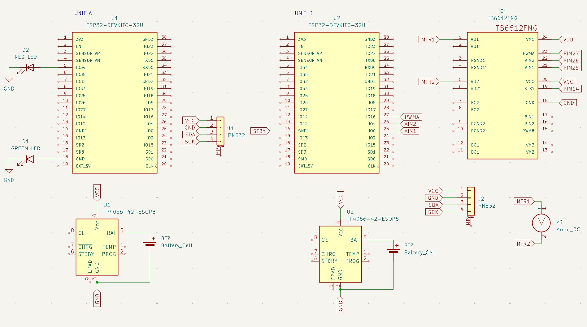

# Project Mariveles — NFC Quiz Matching System

A dual-ESP32 NFC-based quiz matching system using BLE communication, PN532 NFC readers, RGB LEDs, and a DC motor with TB6612FNG driver.

---

## System Overview

Two independent units communicate wirelessly over BLE:

- **Unit A (Answer Unit)** — BLE Server. Holds all Q&A pair logic. Controls green/red LEDs based on match result. Notifies Unit B of result.
- **Unit B (Question Unit)** — BLE Client. Scans question NFC tags and sends UIDs to Unit A. Controls a DC motor that stops on scan and resumes only on a correct match.

```
Unit B                          Unit A
──────                          ──────
Scans question tag              Receives UID via BLE
Stops motor          ──BLE──>  Checks Q&A map
Waits for result    <──BLE──   Lights RED or GREEN LED
Motor resumes on GREEN          Notifies result back
```

---

## Schematic



> Place `schematic.png` in the same directory as this README.

### Unit A — ESP32-DEVKITC-32U
| Signal     | ESP32 Pin |
|------------|-----------|
| SDA (PN532)| IO21      |
| SCL (PN532)| IO22      |
| Green LED  | IO18      |
| Red LED    | IO5       |

### Unit B — ESP32-DEVKITC-32U + TB6612FNG
| Signal        | ESP32 Pin |
|---------------|-----------|
| SDA (PN532)   | IO21      |
| SCL (PN532)   | IO22      |
| Onboard LED   | IO2       |
| MOTOR_IN1     | IO25      |
| MOTOR_IN2     | IO26      |
| MOTOR_PWM (PWMA) | IO27  |
| MOTOR_STBY    | IO14      |

### TB6612FNG Motor Driver
| TB6612FNG Pin | Connection        |
|---------------|-------------------|
| VM            | LiPo + (motor power) |
| VCC           | ESP32 3.3V        |
| GND           | Common GND        |
| STBY          | ESP32 IO14        |
| AIN1          | ESP32 IO25        |
| AIN2          | ESP32 IO26        |
| PWMA          | ESP32 IO27        |
| AO1           | Motor terminal 1  |
| AO2           | Motor terminal 2  |

### Power
- Both units powered via TP4056-42-ESOP8 LiPo charger module
- LiPo BAT+ → ESP32 BAT pin and TB6612FNG VM
- Common GND shared across ESP32, TB6612FNG, PN532

---

## BLE Architecture

| Parameter           | Value                                  |
|---------------------|----------------------------------------|
| Server Name         | `NFC_SET_A`                            |
| Service UUID        | `12345678-1234-1234-1234-123456789abc` |
| Write Characteristic| `abcd1234-ab12-ab12-ab12-abcdef123456` |
| Notify Characteristic| `abcd5678-ab12-ab12-ab12-abcdef123456`|

- Unit B **writes** scanned UID to the Write Characteristic
- Unit A **notifies** Unit B with result: `GREEN`, `RED`, or `NOMATCH`

---

## LED Behavior — Unit A

| Condition                          | Pin 18 (Green) | Pin 5 (Red) |
|------------------------------------|----------------|-------------|
| Correct Q+A match                  | HIGH           | LOW         |
| Question tag scanned on Unit B     | LOW            | HIGH        |
| Question tag scanned on Unit A     | LOW            | HIGH        |
| No match                           | LOW            | LOW         |

## Motor Behavior — Unit B

| Condition         | Motor     |
|-------------------|-----------|
| BLE connected     | Running   |
| Any NFC scan      | Stops     |
| GREEN received    | Resumes   |
| RED / NOMATCH     | Stays off |
| BLE reconnecting  | Stops     |

## Onboard LED — Unit B (Pin 2)

| State         | LED          |
|---------------|--------------|
| Connecting    | Blinking 500ms |
| Connected     | Solid ON     |

---

## Q&A Pair Map (Loaded in Unit A)

| # | Question UID | Answer UID      |
|---|--------------|-----------------|
| 1  | E04D975F    | 04DB2A0ECC2A81  |
| 2  | 1C1EAD05    | 0454FF0BCC2A81  |
| 3  | E409AB05    | 042B2939C92A81  |
| 4  | 2553A905    | 04769C3FC82A81  |
| 5  | 4ABBAD05    | 0432DA3BC92A81  |
| 6  | 11CEAE05    | 0484D43EC82A81  |
| 7  | 7D45AE05    | 045A270DCC2A81  |
| 8  | 262EB205    | 04A51B3FC82A81  |
| 9  | D117AD05    | 040CA6C0790000  |
| 10 | 2CEE6C05    | 049A6330C92A81  |
| 11 | 12F6B105    | 04923539C92A81  |
| 12 | FDF2B105    | 04A7573BC92A81  |
| 13 | D717AF05    | 04BEEE0DCC2A81  |
| 14 | 41BDAD05    | 04581B3FC82A81  |
| 15 | 0A92B205    | 0479150DCC2A81  |
| 16 | 46BF2F72    | 04A42631C92A81  |
| 17 | 18E22083    | 04635C30C92A81  |
| 18 | 38FA0A82    | 04CB6D30C92A81  |
| 19 | 15330982    | 04AF523AC92A81  |
| 20 | C76AEC5C    | 04B2D53BC92A81  |

> To add pairs, edit `qa_map` and `question_uids` in Unit A firmware only. Unit B requires no changes.

---

## Motor Specs

| Parameter         | Value               |
|-------------------|---------------------|
| Model             | Yellow DC Gear Motor |
| Gear Ratio        | 1:120               |
| No-load speed @3V | 50 RPM              |
| No-load speed @5V | 83 RPM              |
| Torque @3V        | 0.8 Kg·cm           |
| Torque @5V        | 1.0 Kg·cm           |
| Internal Gears    | Engineering Plastic |
| Size              | 69 × 37 × 23 mm     |

---

## Dependencies

Install via Arduino Library Manager:

- `Adafruit PN532`
- `Adafruit BusIO`
- ESP32 BLE Arduino (bundled with ESP32 board package)

Board: **ESP32 Dev Module**  
Upload speed: 115200  
Partition scheme: Default

---

## Startup Sequence

1. Flash Unit A first
2. Power Unit A — it begins BLE advertising as `NFC_SET_A`
3. Power Unit B — it scans for `NFC_SET_A`, blinks LED while connecting
4. Once connected, Unit B LED goes solid and motor starts running
5. System is ready

---

## Serial Debug Tags

| Tag           | Unit | Meaning                        |
|---------------|------|--------------------------------|
| `[NFC]`       | Both | NFC tag scanned                |
| `[BLE RX]`    | A    | UID received from Unit B       |
| `[EVAL]`      | A    | Match evaluation result        |
| `[WARN]`      | A    | Question tag on wrong unit     |
| `[NOTIFY]`    | B    | Result received from Unit A    |
| `[MOTOR]`     | B    | Motor state change             |
| `[BLE]`       | Both | BLE connection status          |
